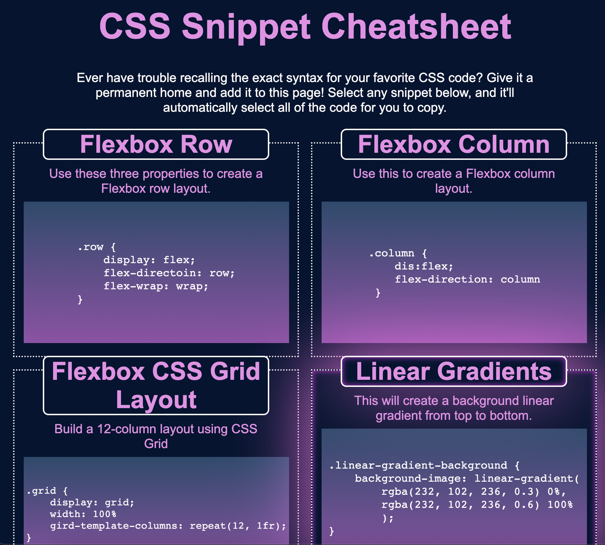
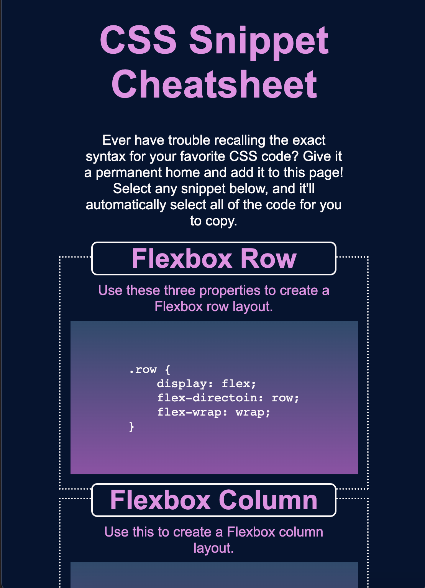

# CSS-Snippet-Cheatsheet

## Description
The CSS-Snippet-Cheatsheet is a user-friendly web app serving as a knowledge base for CSS snippets. Motivated by the need for a quick CSS reference, it offers a visually appealing and responsive platform. The project goes beyond a typical assignment, aiming to be a practical tool for developers, especially those learning CSS.

It effectively solves the problem of forgetting or struggling with specific CSS syntax by providing a centralized location for storing and retrieving snippets. Users can easily identify, copy, and integrate CSS code, streamlining development.

Through the project, hands-on experience was gained with HTML, CSS variables, flexbox, media queries, and various CSS properties. The collaborative nature of the project also fostered teamwork and communication skills, contributing to a well-rounded learning experience.

## Usage
1. Explore the collection of CSS snippets organized in a responsive grid.
2. Click on any snippet to highlight and copy the CSS code.
3. View the application on different devices (desktop, tablet, and mobile) to experience the responsive design.

Desktop View:

Tablet View:

Mobile View:

## License

MIT License

## Features
- Responsive grid layout for different screen sizes.
- Use of semantic HTML elements for better structure.
- CSS variables for easy color scheme adjustments.
- Click-to-copy functionality for each CSS snippet.
- Stylish card-like layout for individual snippets.
- Background color using a linear gradient.
- Transition property for a subtle animation effect.

